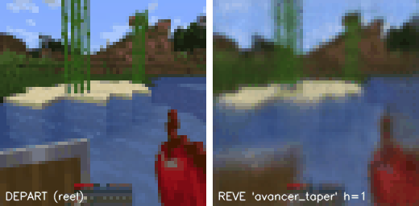
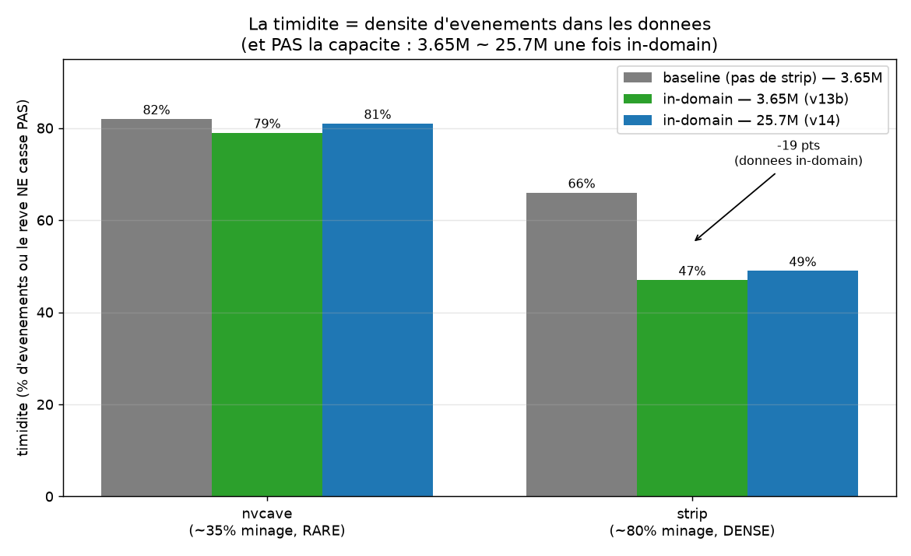
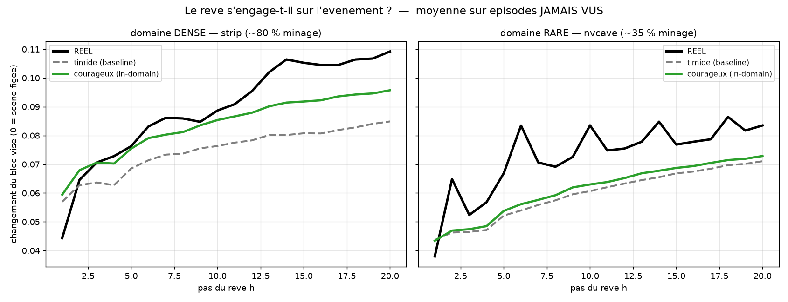
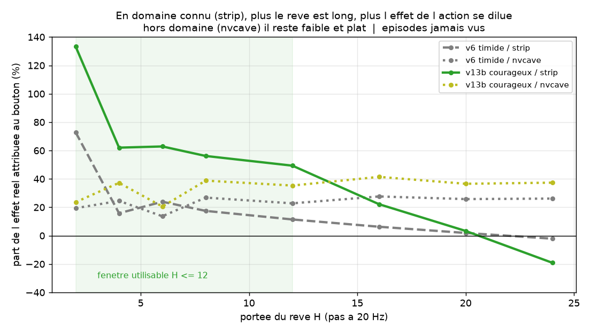

# DREAMCRAFT - un world model visuel de Minecraft

> **Projet de recherche en cours (work in progress).**
> Le Monde 1 (prédire) et le choix hors ligne du Monde 2 sont faits et mesurés. L'agent sur le vrai jeu est codé et validé à vide, mais **n'a pas encore joué en conditions réelles**. Les résultats ci-dessous sont des résultats intermédiaires, pistes négatives comprises. Dernière mise à jour : septembre 2026.

Un modèle qui **rêve la suite d'une partie** : à partir des dernières images et d'une action (« j'avance », « je tape »), il prédit les images suivantes. L'objectif final est qu'il se serve de ces rêves pour **décider seul** de ses actions.

<p align="center">
  
  <br><em>À gauche l'image réelle de départ, à droite le rêve du modèle sous l'action « avancer + taper ». Net sur les premiers pas, il se dégrade avec l'horizon : c'est tout l'enjeu de la portée.</em>
</p>

## La question de recherche

Un world model qui ne fait que rêver ne sert à rien : il doit rêver **pour choisir**. Le projet est donc construit en deux étages :

1. **Monde 1, prédire** : `(images passées, action) → image suivante`, puis en boucle sur plusieurs pas.
2. **Monde 2, choisir** : rêver plusieurs plans candidats, noter le résultat de chacun, jouer le meilleur, recommencer.

Le levier central est la **portée `H`** : combien de pas le modèle peut rêver avant que le rêve ne devienne inutilisable pour décider.

Contraintes assumées : un seul GPU grand public (RTX 4070, 8 Go), un petit modèle (3,65 M de paramètres pour le modèle de référence) et une **évaluation qui refuse de se laisser tromper**.

## Résultats à ce stade

### 1. La « timidité » du rêve vient des données, pas du modèle

Le rêveur refusait souvent de casser le bloc visé : la scène restait figée. Pendant deux semaines, on a exploré les leviers de calcul (capacité, résolution 96 px, loss dédiée) sans rien gagner (plancher ~67 %). La vraie variable, c'est **la fréquence de l'événement dans les données d'entraînement** :

<p align="center"></p>

Avec les mêmes 3,65 M de paramètres, nourrir le modèle de vidéos de minage (domaine dense) fait passer la timidité de 66 % à **47 %**. Un modèle 7× plus gros n'apporte rien de plus (49 %). Là où le minage reste rare dans les données (grottes), tous les modèles restent timides (~80 %).

<p align="center"></p>

Sur des épisodes jamais vus, le modèle nourri en domaine dense rattrape **44 %** de l'écart avec la réalité, contre **15 %** hors domaine. Tous les rêves restent en dessous de la réalité : les bonnes données divisent l'écart par deux environ, elles ne le suppriment pas.

### 2. La portée suit une loi mesurable

Pour chaque départ, on fait rêver le modèle deux fois depuis la même scène : une fois en tapant, une fois avec le même plan sans taper. On mesure alors quelle part de l'effet réel le rêve attribue au bouton.

<p align="center"></p>

En domaine connu, cette part passe de 62 % à 4 pas, à 22 % à 16 pas, puis **change de signe à 24 pas** : la dérive du rêve efface l'effet de l'action. La fenêtre exploitable pour décider est donc **H ≤ 12**.

### 3. Le choix hors ligne fonctionne

Le chooseur rêve plusieurs plans, note chaque rêve avec un détecteur appris de « bloc cassé » et joue le meilleur. Une loss qui pénalise les rêves figés fait passer le bon choix en grotte claire de 63 % à **77 %** à H=8.

## Où ça bloque aujourd'hui

La question qui compte pour un agent est : *« si je tape ici, est-ce que ça servira à quelque chose ? »*. Sur des épisodes jamais vus, on la pose au rêve et on la compare à des baselines **sans aucun modèle** :

| à apparence égale du bloc visé | AUC (50 % = hasard) |
|---|---|
| mesure simple sur les images déjà vues, sans modèle | 63,3 % |
| rêve du modèle | 64,6 % |
| effet causal du bouton dans le rêve | **46,1 %** |

*(Épisodes de grottes, hors domaine. En domaine strip, toutes les méthodes tombent à ~50 %.)*

Le rêve ne fait donc qu'un point de mieux qu'une mesure triviale, et son estimation causale est **sous le hasard**. Autrement dit : **le modèle a appris à dessiner Minecraft, pas à comprendre que c'est l'action qui change la scène.** Un premier chiffre brut à 84 % s'est révélé être un artefact de texture une fois le confondeur neutralisé, d'où la stratification systématique.

**Prochaine étape, déjà codée** : un agent qui joue au vrai jeu (capture d'écran + injection de touches, 20 Hz, ~28 ms par décision) et qui mène des **expériences contrôlées**. Sans bouger, il tape 1,5 s sur un bloc, puis regarde la même scène 1,5 s sans rien faire, puis pivote vers un nouveau bloc. Seul le bouton change entre les deux moments, et les touches envoyées sont connues exactement. Aucune vidéo en ligne ne fournit ce signal : les actions y sont devinées et mêlées au mouvement du joueur. On mesurera ensuite si ces paires font monter les deux chiffres ci-dessus.

## Méthode

**Données**
- 234 épisodes [VPT](https://github.com/openai/Video-Pre-Training) (OpenAI, Minecraft 1.16.5) : vidéo 20 Hz et touches du joueur humain.
- 87 épisodes YouTube de joueurs en *full brightness* : grottes (1.18) et strip-mining (1.19). Leurs touches sont inférées par un **modèle de dynamique inverse** entraîné sur VPT (F1 = 0,92 sur « taper »).
- Images en 64×64 (et 96×96 pour l'étude de résolution). Environ 30 Go au total, non versionnés.

**Modèle** : encodeur-décodeur convolutif à connexions de saut, contexte de 4 images, action injectée par FiLM au goulot. Entraînement en rollout avec un curriculum K = 1 → 16 pas, baisse du taux d'apprentissage à chaque palier, EMA des poids et gradient checkpointing (VRAM constante quel que soit K).

**Évaluation** (protocole gelé avant tout entraînement, voir [docs/CADRE_DREAMCRAFT.md](docs/CADRE_DREAMCRAFT.md))
- Des **baselines d'abord** : copie de la dernière image, flux optique.
- Une erreur calculée **uniquement sur les pixels qui changent** (Δ-region). La MSE globale récompense un rêve figé, puisque la plupart des pixels ne bougent pas.
- Sélection des checkpoints sur la métrique honnête, jamais sur la loss.
- Épisodes de validation **jamais vus** et exclus de tout entraînement.
- Tests **contrefactuels** (même scène, action différente) et baselines **sans modèle** avec stratification des confondeurs.
- Dix règles du jeu transformées en sondes automatiques (temps de cassage, dégâts de chute, faim…), à partir de 10 ans de pratique de Minecraft.

## Journal de recherche

Tout le cheminement est consigné dans [docs/JOURNAL.md](docs/JOURNAL.md) : 20 leçons, **pistes négatives comprises** (gamma simulé, montée en capacité, résolution 96 px, première tentative de données confondue). C'est le document à lire pour comprendre *pourquoi* chaque choix a été fait.

## Organisation du repo

```
src/dreamcraft/
  data/      chargement VPT, encodage des actions, fenêtres de contexte
  models/    prédicteur conv + FiLM, modèle de dynamique inverse
  eval/      métrique Δ-region, baselines (copie, flux optique)
scripts/     entraînement, évaluation, sondes, agent (index : scripts/README.md)
docs/        cadre, journal de recherche, figures
data/        données brutes et converties       (non versionné)
outputs/     checkpoints, logs, rollouts         (non versionné)
```

## Lancer le projet

Testé sous Windows 11, Python 3.11, CUDA 12.6.

```bash
python -m venv .venv
.venv\Scripts\python.exe -m pip install -r requirements.txt
```

```bash
.venv\Scripts\python.exe scripts\smoke_test_data.py
```

```bash
.venv\Scripts\python.exe scripts\build_dataset.py 20
```

```bash
.venv\Scripts\python.exe scripts\train_v7.py
```

L'entraîneur principal se configure par variables d'environnement `DC_*` (résolution, capacité, loss, sources de données) ; elles sont décrites dans l'en-tête de [scripts/train_v7.py](scripts/train_v7.py). L'agent se teste sans le jeu :

```bash
.venv\Scripts\python.exe scripts\agent_loop.py --env replay --policy chooser --steps 100
```

Les checkpoints ne sont pas versionnés (trop lourds). Les scripts d'évaluation attendent les modèles de référence dans `outputs/`.

## Statut

| étape | état |
|---|---|
| Pipeline de données (VPT + YouTube + IDM) | fait |
| Monde 1 : prédiction multi-pas, portée honnête 69 pas (3,45 s) | fait |
| Timidité expliquée par la couverture de données | fait |
| Monde 2 : choix hors ligne entre plans rêvés | fait |
| Diagnostic du plafond (attribution de l'action) | fait |
| Agent sur le vrai jeu, validé à vide | fait (jamais lancé en jeu) |
| Collecte de paires contrefactuelles en jeu | prochaine étape |
| Réentraînement sur ces paires, puis nouvelle mesure | à faire |
| Agent autonome en jeu | objectif |

## Crédits

- Les données d'entraînement viennent du projet [VPT](https://github.com/openai/Video-Pre-Training) d'OpenAI. Elles ne sont pas redistribuées ici : les scripts les téléchargent depuis la source.
- Le GIF et les figures montrent des images d'épisodes VPT (le GIF : `treechop-984393664dfd-20210924-174326`, un épisode jamais vu à l'entraînement).
- Minecraft est la propriété de Microsoft, ce projet n'est affilié ni à Microsoft ni à OpenAI.

## Licence

Le code est sous licence [MIT](LICENSE).

---
**Florent Baumet Dudbout**, élève-ingénieur à Centrale Méditerranée (vision, ML, PyTorch) · [LinkedIn](https://www.linkedin.com/in/florent-baumet-dudbout)
